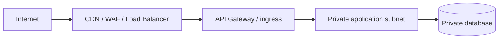
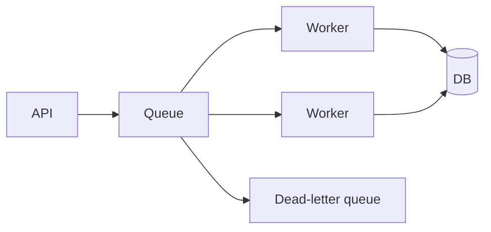
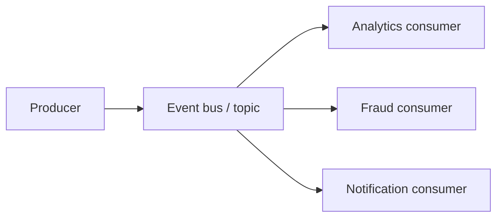

# Cloud Architecture Patterns

A compact catalog of reusable system-design patterns with AWS, GCP, Azure and Huawei Cloud mappings.

| Pattern | AWS | GCP | Azure | Huawei Cloud |
|---|---|---|---|---|
| Object storage | S3 | Cloud Storage | Blob Storage | OBS |
| Managed Kubernetes | EKS | GKE | AKS | CCE |
| Serverless compute | Lambda | Cloud Functions / Cloud Run jobs | Functions | FunctionGraph |
| Event bus | EventBridge | Eventarc / Pub/Sub | Event Grid | EventGrid |
| Queue | SQS | Pub/Sub | Service Bus | DMS / queues |
| Relational DB | RDS/Aurora | Cloud SQL | Azure Database for PostgreSQL | RDS/GaussDB |
| Cache | ElastiCache | Memorystore | Azure Cache for Redis | DCS |
| ML platform | SageMaker | Vertex AI | Azure ML | ModelArts |
| Monitoring | CloudWatch | Cloud Monitoring | Azure Monitor | Cloud Eye |

## Patterns

### Public edge, private compute



### Async work queue



### Event-driven fan-out



### Cache-aside

1. Read from cache.
2. On miss, read database.
3. Populate cache with TTL.
4. Invalidate/update on authoritative writes.

### Saga

Use compensating actions instead of one distributed ACID transaction when independent services own separate data stores.

### Transactional outbox

Commit business state and an outbox event in one local database transaction, then publish asynchronously. This avoids the dual-write failure window.

The goal of this repository is not memorizing vendor names; it is learning architectures that survive vendor changes.


## Executable reliability control

The catalog now includes a dependency-free multi-window SLO burn-rate evaluator in
`src/cloud_patterns/slo_burn_rate.py`. It converts request/failure counters into
vendor-neutral operational evidence:

- error rate and error-budget burn rate for every window;
- paired fast/slow-window alerting to distinguish spikes from sustained failures;
- minimum-traffic gates that fail closed when evidence is too sparse;
- deterministic JSON-ready evidence and reason codes;
- strict validation for duplicate windows and invalid counters.

```python
from cloud_patterns.slo_burn_rate import BurnRatePolicy, SLIWindow, evaluate_burn_rate

decision = evaluate_burn_rate(
    [SLIWindow("5m", 10_000, 160), SLIWindow("1h", 100_000, 700)],
    fast_window="5m",
    slow_window="1h",
    policy=BurnRatePolicy(objective=0.999),
)
print(decision.to_dict())
```

Thresholds are configurable operational policy, not universal defaults. The evaluator
assumes the supplied counters use the same SLI definition and correctly nested time
windows; it does not query a monitoring backend or deduplicate requests.
